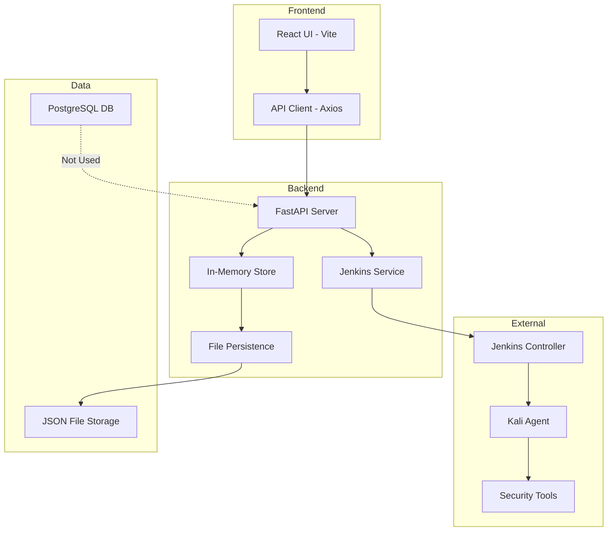
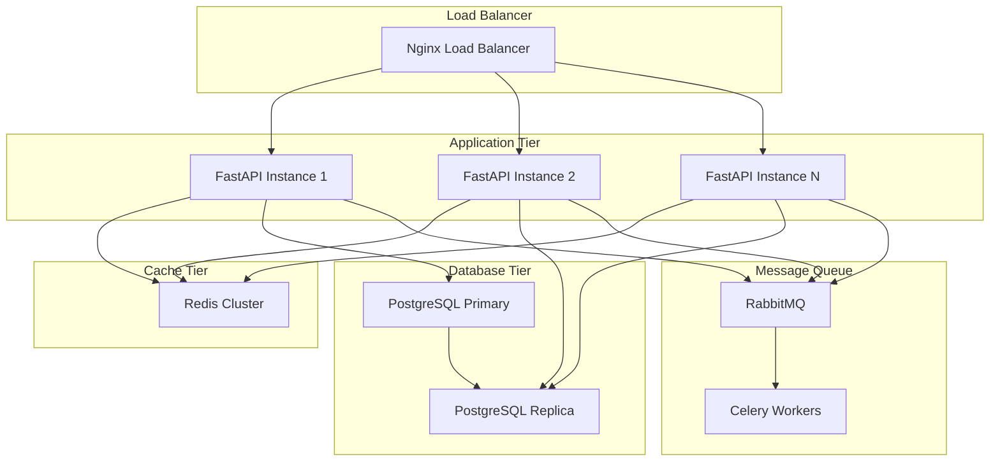
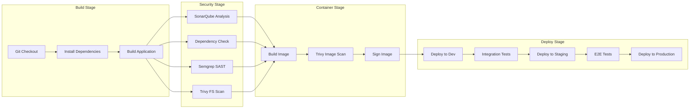

# DevSecOps Control Plane - Comprehensive Codebase Analysis & Improvement Plan

## Executive Summary

This document provides a thorough analysis of the DevSecOps Control Platform codebase, identifying code issues, performance bottlenecks, security vulnerabilities, and scalability concerns. The analysis covers frontend (React/TypeScript), backend (FastAPI/Python), CI/CD pipeline (Jenkins), and infrastructure components.

---

## Table of Contents

1. [Architecture Overview](#architecture-overview)
2. [Critical Code Issues](#critical-code-issues)
3. [Performance Optimization Plan](#performance-optimization-plan)
4. [Scalability Improvements](#scalability-improvements)
5. [Security Enhancements](#security-enhancements)
6. [CI/CD Pipeline Improvements](#cicd-pipeline-improvements)
7. [Infrastructure Optimization](#infrastructure-optimization)
8. [Implementation Roadmap](#implementation-roadmap)

---

## Architecture Overview

### Current System Architecture



### Technology Stack

| Layer | Technology | Version | Purpose |
|-------|------------|---------|---------|
| Frontend | React + TypeScript | 19.2.0 | UI Framework |
| Build Tool | Vite | 7.2.4 | Build & Dev Server |
| Styling | Tailwind CSS | 4.1.18 | Utility-first CSS |
| Backend | FastAPI | 0.111.0+ | REST API Framework |
| Server | Uvicorn | 0.30.0+ | ASGI Server |
| Validation | Pydantic | 2.7.0+ | Data Validation |
| CI/CD | Jenkins | N/A | Pipeline Orchestration |
| Container | Docker | N/A | Containerization |
| Database | PostgreSQL | 16-alpine | Persistent Storage |

---

## Critical Code Issues

### 1. Backend Issues

#### Issue 1.1: In-Memory Database Not Using PostgreSQL

**Location**: [`backend/app/state/store.py`](backend/app/state/store.py)

**Problem**: The application uses an in-memory dictionary for data storage despite PostgreSQL being configured. This limits scalability and persistence.

```python
# Current Implementation
projects_db: dict = {}
scans_db: dict = {}
scans_db_lock = RLock()
```

**Impact**:
- Data loss on application restart
- No horizontal scaling capability
- Memory constraints with large datasets

**Solution**: Implement proper database layer with SQLAlchemy

```python
# Recommended Implementation
from sqlalchemy import create_engine, Column, String, DateTime, JSON
from sqlalchemy.ext.declarative import declarative_base
from sqlalchemy.orm import sessionmaker

Base = declarative_base()

class Project(Base):
    __tablename__ = "projects"
    project_id = Column(String, primary_key=True)
    name = Column(String, nullable=False)
    git_url = Column(String, nullable=False)
    branch = Column(String, default="main")
    credentials_id = Column(String)
    sonar_key = Column(String)
    target_ip = Column(String, nullable=True)
    target_url = Column(String, nullable=True)
    last_scan_state = Column(String, default="NONE")
    created_at = Column(DateTime)
    updated_at = Column(DateTime)

class Scan(Base):
    __tablename__ = "scans"
    scan_id = Column(String, primary_key=True)
    project_id = Column(String, nullable=False)
    scan_mode = Column(String, nullable=False)
    state = Column(String, nullable=False)
    selected_stages = Column(JSON)
    stage_results = Column(JSON)
    created_at = Column(DateTime)
    started_at = Column(DateTime)
    finished_at = Column(DateTime)
```

#### Issue 1.2: Single-Worker Constraint

**Location**: [`backend/app/main.py:49-50`](backend/app/main.py:49)

**Problem**: Application enforces single worker, preventing horizontal scaling.

```python
# Current Implementation
worker_count = int(os.environ.get("WEB_CONCURRENCY", "1"))
if worker_count > 1:
    raise RuntimeError(f"WEB_CONCURRENCY={worker_count} is forbidden...")
```

**Impact**:
- Cannot scale beyond single process
- Limited request throughput
- Single point of failure

**Solution**: Implement proper state management for multi-worker support

```python
# Recommended: Use Redis for shared state
import redis
from functools import wraps

class RedisStateManager:
    def __init__(self, redis_url: str):
        self.redis = redis.from_url(redis_url)
        self.lock_timeout = 30
    
    def acquire_lock(self, key: str) -> bool:
        return self.redis.set(key, "locked", nx=True, ex=self.lock_timeout)
    
    def release_lock(self, key: str):
        self.redis.delete(key)
    
    def get_scan_state(self, scan_id: str) -> Optional[dict]:
        data = self.redis.get(f"scan:{scan_id}")
        return json.loads(data) if data else None
    
    def set_scan_state(self, scan_id: str, state: dict):
        self.redis.set(f"scan:{scan_id}", json.dumps(state))
```

#### Issue 1.3: Missing Error Handling in API Client

**Location**: [`src/services/api.ts:17-25`](src/services/api.ts:17)

**Problem**: API client silently catches errors and returns empty arrays, hiding failures.

```typescript
// Current Implementation
list: async (): Promise<Project[]> => {
  try {
    const response = await apiClient.get('/projects');
    return Array.isArray(response.data) ? response.data : [];
  } catch (err) {
    console.error('API projects.list error:', err);
    return [];  // Silent failure
  }
},
```

**Impact**:
- Users unaware of API failures
- Debugging difficulty
- Data inconsistency

**Solution**: Implement proper error handling with user feedback

```typescript
// Recommended Implementation
class ApiError extends Error {
  constructor(
    public status: number,
    public message: string,
    public details?: unknown
  ) {
    super(message);
    this.name = 'ApiError';
  }
}

export const api = {
  projects: {
    list: async (): Promise<Project[]> => {
      const response = await apiClient.get('/projects');
      if (!Array.isArray(response.data)) {
        throw new ApiError(500, 'Invalid response format');
      }
      return response.data;
    },
    // ... other methods
  },
};

// Error boundary in React
class ApiErrorBoundary extends React.Component {
  state = { hasError: false, error: null };
  
  static getDerivedStateFromError(error: ApiError) {
    return { hasError: true, error };
  }
  
  render() {
    if (this.state.hasError) {
      return <ErrorDisplay error={this.state.error} />;
    }
    return this.props.children;
  }
}
```

### 2. Frontend Issues

#### Issue 2.1: Missing Loading States

**Location**: [`src/pages/CreateProjectPage.tsx:23-28`](src/pages/CreateProjectPage.tsx:23)

**Problem**: No error feedback to user when project creation fails.

```typescript
// Current Implementation
const handleSubmit = async (e: React.FormEvent) => {
  e.preventDefault();
  setLoading(true);
  try {
    await api.projects.create(formData);
    navigate('/dashboard');
  } catch (err) {
    console.error(err);
    setLoading(false);  // Only logs error, no user feedback
  }
};
```

**Solution**: Add error state and user feedback

```typescript
// Recommended Implementation
const [error, setError] = useState<string | null>(null);

const handleSubmit = async (e: React.FormEvent) => {
  e.preventDefault();
  setLoading(true);
  setError(null);
  
  try {
    await api.projects.create(formData);
    navigate('/dashboard');
  } catch (err: any) {
    const message = err?.response?.data?.detail || 
                    err?.message || 
                    'Failed to create project';
    setError(message);
    setLoading(false);
  }
};

// Add error display in JSX
{error && (
  <div className="bg-red-50 border border-red-200 text-red-700 rounded-lg px-4 py-3 text-sm mb-6">
    {error}
  </div>
)}
```

#### Issue 2.2: No Polling for Scan Status Updates

**Location**: [`src/pages/ScanStatusPage.tsx`](src/pages/ScanStatusPage.tsx)

**Problem**: Scan status page does not auto-refresh, requiring manual page reload.

**Solution**: Implement polling with React Query or SWR

```typescript
// Recommended Implementation using SWR
import useSWR from 'swr';

const useScanStatus = (scanId: string) => {
  const { data, error, isLoading } = useSWR(
    `/scans/${scanId}`,
    () => api.scans.get(scanId),
    {
      refreshInterval: (data) => {
        // Stop polling when scan is complete
        if (data?.state === 'COMPLETED' || data?.state === 'FAILED') {
          return 0;
        }
        return 2000; // Poll every 2 seconds
      },
      revalidateOnFocus: true,
    }
  );
  
  return { scan: data, error, isLoading };
};
```

### 3. CI/CD Pipeline Issues

#### Issue 3.1: No Parallel Stage Execution

**Location**: [`Jenkinsfile`](Jenkinsfile)

**Problem**: All stages run sequentially, increasing pipeline duration.

**Solution**: Implement parallel execution for independent stages

```groovy
// Recommended Implementation
stage('Security Scans') {
    parallel {
        stage('Trivy FS Scan') {
            steps {
                script {
                    // Trivy FS scan logic
                }
            }
        }
        stage('Dependency Check') {
            steps {
                script {
                    // Dependency check logic
                }
            }
        }
        stage('Sonar Scanner') {
            steps {
                script {
                    // Sonar scan logic
                }
            }
        }
    }
}
```

#### Issue 3.2: Missing Pipeline Notifications

**Problem**: No notifications for pipeline success/failure.

**Solution**: Add notification stages

```groovy
post {
    success {
        script {
            slackSend(
                color: 'good',
                message: "✅ Pipeline Successful - ${env.JOB_NAME} #${env.BUILD_NUMBER}"
            )
        }
    }
    failure {
        script {
            slackSend(
                color: 'danger',
                message: "❌ Pipeline Failed - ${env.JOB_NAME} #${env.BUILD_NUMBER}\n<${env.BUILD_URL}|View Details>"
            )
        }
    }
}
```

---

## Performance Optimization Plan

### 1. Backend Performance

#### Optimization 1.1: Implement Caching Layer

**Current State**: Every request queries the in-memory store.

**Recommendation**: Add Redis caching for frequently accessed data.

```python
# backend/app/core/cache.py
from functools import wraps
import redis
import json

class CacheManager:
    def __init__(self, redis_url: str):
        self.redis = redis.from_url(redis_url)
    
    def cached(self, key_prefix: str, ttl: int = 60):
        def decorator(func):
            @wraps(func)
            async def wrapper(*args, **kwargs):
                cache_key = f"{key_prefix}:{':'.join(map(str, args))}"
                cached = self.redis.get(cache_key)
                if cached:
                    return json.loads(cached)
                
                result = await func(*args, **kwargs)
                self.redis.setex(cache_key, ttl, json.dumps(result))
                return result
            return wrapper
        return decorator

# Usage
@cache.cached("projects", ttl=300)
async def list_projects():
    # ... database query
```

#### Optimization 1.2: Batch Persistence

**Current State**: [`backend/app/state/persistence.py`](backend/app/state/persistence.py) writes to disk on every state change.

**Recommendation**: Implement batch persistence with configurable intervals.

```python
# backend/app/state/batch_persistence.py
import asyncio
from typing import Dict, Any
from datetime import datetime

class BatchPersistence:
    def __init__(self, interval_seconds: int = 5):
        self.interval = interval_seconds
        self.pending_changes = False
        self._task = None
    
    async def start(self):
        self._task = asyncio.create_task(self._persistence_loop())
    
    async def _persistence_loop(self):
        while True:
            await asyncio.sleep(self.interval)
            if self.pending_changes:
                await self._flush()
                self.pending_changes = False
    
    def mark_dirty(self):
        self.pending_changes = True
    
    async def _flush(self):
        # Perform actual persistence
        persist_state(scans_db, projects_db)

# In main.py
@app.on_event("startup")
async def startup():
    batch_persistence = BatchPersistence(interval_seconds=5)
    await batch_persistence.start()
```

#### Optimization 1.3: Database Connection Pooling

**Recommendation**: Implement connection pooling for PostgreSQL.

```python
# backend/app/core/database.py
from sqlalchemy import create_engine
from sqlalchemy.orm import sessionmaker
from sqlalchemy.pool import QueuePool

engine = create_engine(
    settings.DATABASE_URL,
    poolclass=QueuePool,
    pool_size=10,
    max_overflow=20,
    pool_pre_ping=True,
    pool_recycle=3600,
)

SessionLocal = sessionmaker(autocommit=False, autoflush=False, bind=engine)

# Dependency
def get_db():
    db = SessionLocal()
    try:
        yield db
    finally:
        db.close()
```

### 2. Frontend Performance

#### Optimization 2.1: Code Splitting

**Current State**: Single bundle for entire application.

**Recommendation**: Implement route-based code splitting.

```typescript
// src/App.tsx - Recommended Implementation
import { lazy, Suspense } from 'react';

const DashboardPage = lazy(() => import('./pages/DashboardPage'));
const CreateProjectPage = lazy(() => import('./pages/CreateProjectPage'));
const ProjectControlPage = lazy(() => import('./pages/ProjectControlPage'));
const ManualScanPage = lazy(() => import('./pages/ManualScanPage'));
const ScanStatusPage = lazy(() => import('./pages/ScanStatusPage'));

function App() {
  return (
    <BrowserRouter>
      <Routes>
        <Route path="/login" element={<LoginPage />} />
        <Route element={<Layout />}>
          <Route path="/" element={<Navigate to="/dashboard" replace />} />
          <Route 
            path="/dashboard" 
            element={
              <Suspense fallback={<LoadingSpinner />}>
                <DashboardPage />
              </Suspense>
            } 
          />
          {/* ... other routes */}
        </Route>
      </Routes>
    </BrowserRouter>
  );
}
```

#### Optimization 2.2: Virtual Scrolling for Large Lists

**Recommendation**: Implement virtual scrolling for project lists.

```typescript
// Using react-window for large lists
import { FixedSizeList } from 'react-window';

const ProjectList = ({ projects }: { projects: Project[] }) => (
  <FixedSizeList
    height={600}
    itemCount={projects.length}
    itemSize={80}
    width="100%"
  >
    {({ index, style }) => (
      <div style={style}>
        <ProjectRow project={projects[index]} />
      </div>
    )}
  </FixedSizeList>
);
```

---

## Scalability Improvements

### 1. Horizontal Scaling Architecture



### 2. Database Migration Strategy

**Phase 1**: Add SQLAlchemy models alongside in-memory store

```python
# backend/app/models/db_models.py
from sqlalchemy import Column, String, DateTime, JSON, ForeignKey
from sqlalchemy.orm import relationship
from app.core.database import Base

class ProjectDB(Base):
    __tablename__ = "projects"
    
    project_id = Column(String, primary_key=True)
    name = Column(String, nullable=False, index=True)
    git_url = Column(String, nullable=False)
    branch = Column(String, default="main")
    credentials_id = Column(String)
    sonar_key = Column(String)
    target_ip = Column(String, nullable=True)
    target_url = Column(String, nullable=True)
    last_scan_state = Column(String, default="NONE", index=True)
    created_at = Column(DateTime, nullable=False)
    updated_at = Column(DateTime, nullable=False)
    
    scans = relationship("ScanDB", back_populates="project")

class ScanDB(Base):
    __tablename__ = "scans"
    
    scan_id = Column(String, primary_key=True)
    project_id = Column(String, ForeignKey("projects.project_id"), nullable=False, index=True)
    scan_mode = Column(String, nullable=False)
    state = Column(String, nullable=False, index=True)
    selected_stages = Column(JSON)
    stage_results = Column(JSON)
    jenkins_build_number = Column(String)
    jenkins_queue_id = Column(String)
    created_at = Column(DateTime, nullable=False)
    started_at = Column(DateTime, nullable=True)
    finished_at = Column(DateTime, nullable=True)
    
    project = relationship("ProjectDB", back_populates="scans")
```

**Phase 2**: Implement repository pattern for data access

```python
# backend/app/repositories/scan_repository.py
from typing import Optional, List
from sqlalchemy.orm import Session
from app.models.db_models import ScanDB
from app.models.scan import Scan
from app.state.scan_state import ScanState

class ScanRepository:
    def __init__(self, db: Session):
        self.db = db
    
    def get(self, scan_id: str) -> Optional[Scan]:
        db_scan = self.db.query(ScanDB).filter(ScanDB.scan_id == scan_id).first()
        if not db_scan:
            return None
        return self._to_domain(db_scan)
    
    def get_active_by_project(self, project_id: str) -> Optional[Scan]:
        active_states = [ScanState.CREATED, ScanState.QUEUED, ScanState.RUNNING]
        db_scan = (
            self.db.query(ScanDB)
            .filter(ScanDB.project_id == project_id)
            .filter(ScanDB.state.in_(active_states))
            .first()
        )
        return self._to_domain(db_scan) if db_scan else None
    
    def save(self, scan: Scan) -> Scan:
        db_scan = self._to_db(scan)
        self.db.merge(db_scan)
        self.db.commit()
        return scan
    
    def _to_domain(self, db_scan: ScanDB) -> Scan:
        # Convert DB model to domain model
        pass
    
    def _to_db(self, scan: Scan) -> ScanDB:
        # Convert domain model to DB model
        pass
```

### 3. Async Job Processing

**Recommendation**: Implement Celery for async Jenkins job management

```python
# backend/app/tasks/jenkins_tasks.py
from celery import Celery
from app.services.jenkins_service import jenkins_service

celery_app = Celery(
    "devsecops",
    broker=settings.CELERY_BROKER_URL,
    backend=settings.CELERY_RESULT_BACKEND,
)

@celery_app.task(bind=True, max_retries=3)
def trigger_jenkins_scan(self, scan_id: str, project_data: dict):
    try:
        result = jenkins_service.trigger_scan_job(scan_id, project_data)
        return result
    except Exception as exc:
        raise self.retry(exc=exc, countdown=60)

@celery_app.task
def check_scan_status(scan_id: str):
    # Poll Jenkins for scan status
    pass
```

---

## Security Enhancements

### 1. API Security

#### Enhancement 1.1: Rate Limiting

```python
# backend/app/middleware/rate_limit.py
from fastapi import Request, HTTPException
from slowapi import Limiter
from slowapi.util import get_remote_address

limiter = Limiter(key_func=get_remote_address)

@app.middleware("http")
async def rate_limit_middleware(request: Request, call_next):
    # Rate limit: 100 requests per minute
    if limiter.hit("100/minute", get_remote_address(request)):
        return await call_next(request)
    raise HTTPException(status_code=429, detail="Too many requests")
```

#### Enhancement 1.2: Input Sanitization

```python
# backend/app/core/sanitization.py
import re
from html import escape

def sanitize_input(value: str, max_length: int = 1000) -> str:
    """Sanitize user input to prevent injection attacks."""
    if not value:
        return value
    
    # Truncate to max length
    value = value[:max_length]
    
    # Escape HTML entities
    value = escape(value)
    
    # Remove potential script injection patterns
    dangerous_patterns = [
        r'<script.*?>.*?</script>',
        r'javascript:',
        r'on\w+\s*=',
    ]
    for pattern in dangerous_patterns:
        value = re.sub(pattern, '', value, flags=re.IGNORECASE)
    
    return value
```

#### Enhancement 1.3: API Key Rotation

```python
# backend/app/core/api_key_manager.py
import secrets
from datetime import datetime, timedelta
from typing import Optional

class ApiKeyManager:
    def __init__(self, rotation_days: int = 90):
        self.rotation_days = rotation_days
    
    def generate_api_key(self) -> str:
        return secrets.token_urlsafe(32)
    
    def should_rotate(self, created_at: datetime) -> bool:
        return datetime.utcnow() - created_at > timedelta(days=self.rotation_days)
    
    def validate_api_key(self, api_key: str, stored_hash: str) -> bool:
        return secrets.compare_digest(
            self._hash_key(api_key),
            stored_hash
        )
    
    def _hash_key(self, key: str) -> str:
        import hashlib
        return hashlib.sha256(key.encode()).hexdigest()
```

### 2. Frontend Security

#### Enhancement 2.1: Content Security Policy

```typescript
// vite.config.ts - Add CSP headers
export default defineConfig({
  plugins: [react()],
  server: {
    headers: {
      'Content-Security-Policy': [
        "default-src 'self'",
        "script-src 'self' 'unsafe-inline'",
        "style-src 'self' 'unsafe-inline'",
        "img-src 'self' data: https:",
        "connect-src 'self' https://api.example.com",
      ].join('; '),
    },
  },
});
```

#### Enhancement 2.2: XSS Prevention

```typescript
// src/utils/sanitize.ts
import DOMPurify from 'dompurify';

export const sanitizeHtml = (html: string): string => {
  return DOMPurify.sanitize(html, {
    ALLOWED_TAGS: ['b', 'i', 'em', 'strong', 'a'],
    ALLOWED_ATTR: ['href'],
  });
};

// Usage in components
<div dangerouslySetInnerHTML={{ __html: sanitizeHtml(userContent) }} />
```

### 3. Infrastructure Security

#### Enhancement 3.1: Network Policies

```yaml
# kubernetes/network-policy.yaml
apiVersion: networking.k8s.io/v1
kind: NetworkPolicy
metadata:
  name: backend-network-policy
spec:
  podSelector:
    matchLabels:
      app: backend
  policyTypes:
    - Ingress
    - Egress
  ingress:
    - from:
        - podSelector:
            matchLabels:
              app: frontend
      ports:
        - protocol: TCP
          port: 8000
  egress:
    - to:
        - podSelector:
            matchLabels:
              app: postgres
      ports:
        - protocol: TCP
          port: 5432
    - to:
        - podSelector:
            matchLabels:
              app: redis
      ports:
        - protocol: TCP
          port: 6379
```

#### Enhancement 3.2: Secret Management

```yaml
# kubernetes/external-secrets.yaml
apiVersion: external-secrets.io/v1beta1
kind: ExternalSecret
metadata:
  name: api-secrets
spec:
  refreshInterval: 1h
  secretStoreRef:
    name: vault-backend
    kind: ClusterSecretStore
  target:
    name: api-secrets
    creationPolicy: Owner
  data:
    - secretKey: api-key
      remoteRef:
        key: devsecops/api
        property: api_key
    - secretKey: callback-token
      remoteRef:
        key: devsecops/api
        property: callback_token
```

---

## CI/CD Pipeline Improvements

### 1. Enhanced Pipeline Structure



### 2. Pipeline Configuration

```groovy
// Jenkinsfile - Enhanced Version
pipeline {
    agent { label 'kali' }
    
    options {
        buildDiscarder(logRotator(numToKeepStr: '50'))
        disableConcurrentBuilds()
        timeout(time: 2, unit: 'HOURS')
        timestamps()
        ansiColor('xterm')
    }
    
    environment {
        DOCKER_REGISTRY = 'registry.example.com'
        IMAGE_NAME = "${DOCKER_REGISTRY}/devsecops/platform"
        IMAGE_TAG = "${env.BUILD_NUMBER}"
    }
    
    stages {
        stage('Build') {
            parallel {
                stage('Frontend Build') {
                    steps {
                        sh 'npm ci'
                        sh 'npm run build'
                    }
                }
                stage('Backend Build') {
                    steps {
                        sh 'pip install -r requirements.txt'
                    }
                }
            }
        }
        
        stage('Security Scanning') {
            parallel {
                stage('SonarQube') {
                    steps {
                        withSonarQubeEnv('sonar-server') {
                            sh 'sonar-scanner'
                        }
                    }
                }
                stage('Dependency Check') {
                    steps {
                        sh 'dependency-check --scan . --format JSON'
                    }
                }
                stage('Semgrep SAST') {
                    steps {
                        sh 'semgrep --config=auto --json --output=semgrep-report.json .'
                    }
                }
                stage('Trivy FS') {
                    steps {
                        sh 'trivy fs --format json --output trivy-fs-report.json .'
                    }
                }
            }
        }
        
        stage('Quality Gates') {
            steps {
                script {
                    // Fail if any security scan found critical vulnerabilities
                    def trivyReport = readJSON file: 'trivy-fs-report.json'
                    def criticalVulns = trivyReport.Results?.findResults { 
                        it.Vulnerabilities?.count { it.Severity == 'CRITICAL' } 
                    }?.sum() ?: 0
                    
                    if (criticalVulns > 0) {
                        error("Found ${criticalVulns} critical vulnerabilities")
                    }
                }
            }
        }
        
        stage('Container Build & Scan') {
            steps {
                sh "docker build -t ${IMAGE_NAME}:${IMAGE_TAG} ."
                sh "trivy image --format json --output trivy-image-report.json ${IMAGE_NAME}:${IMAGE_TAG}"
            }
        }
        
        stage('Deploy to Dev') {
            when {
                branch 'develop'
            }
            steps {
                sh "kubectl set image deployment/backend backend=${IMAGE_NAME}:${IMAGE_TAG} -n dev"
                sh "kubectl rollout status deployment/backend -n dev --timeout=300s"
            }
        }
        
        stage('Integration Tests') {
            steps {
                sh 'pytest tests/integration/ -v --junitxml=integration-results.xml'
            }
        }
        
        stage('Deploy to Staging') {
            when {
                branch 'main'
            }
            steps {
                sh "kubectl set image deployment/backend backend=${IMAGE_NAME}:${IMAGE_TAG} -n staging"
                sh "kubectl rollout status deployment/backend -n staging --timeout=300s"
            }
        }
        
        stage('E2E Tests') {
            steps {
                sh 'playwright test --project=chromium'
            }
        }
        
        stage('Deploy to Production') {
            when {
                branch 'main'
            }
            steps {
                input message: 'Deploy to Production?', ok: 'Deploy'
                sh "kubectl set image deployment/backend backend=${IMAGE_NAME}:${IMAGE_TAG} -n production"
                sh "kubectl rollout status deployment/backend -n production --timeout=300s"
            }
        }
    }
    
    post {
        always {
            archiveArtifacts artifacts: '*-report.json', allowEmptyArchive: true
            junit '**/test-results/*.xml'
        }
        success {
            slackSend(color: 'good', message: "✅ Build Successful: ${env.JOB_NAME} #${env.BUILD_NUMBER}")
        }
        failure {
            slackSend(color: 'danger', message: "❌ Build Failed: ${env.JOB_NAME} #${env.BUILD_NUMBER}")
        }
    }
}
```

---

## Infrastructure Optimization

### 1. Docker Optimization

```dockerfile
# docker/backend.Dockerfile - Optimized Multi-stage Build
FROM python:3.11-slim as builder

WORKDIR /app

# Install build dependencies
RUN apt-get update && apt-get install -y --no-install-recommends \
    build-essential \
    && rm -rf /var/lib/apt/lists/*

# Create virtual environment
RUN python -m venv /opt/venv
ENV PATH="/opt/venv/bin:$PATH"

# Install dependencies
COPY requirements.txt .
RUN pip install --no-cache-dir -r requirements.txt

# Production stage
FROM python:3.11-slim as production

WORKDIR /app

# Copy virtual environment from builder
COPY --from=builder /opt/venv /opt/venv
ENV PATH="/opt/venv/bin:$PATH"

# Copy application code
COPY --chown=appuser:appuser backend ./backend

# Create non-root user
RUN useradd -m -u 1000 appuser
USER appuser

# Health check
HEALTHCHECK --interval=30s --timeout=10s --start-period=5s --retries=3 \
    CMD curl -f http://localhost:8000/ || exit 1

# Expose port
EXPOSE 8000

# Run application
CMD ["uvicorn", "app.main:app", "--host", "0.0.0.0", "--port", "8000"]
```

### 2. Kubernetes Deployment

```yaml
# kubernetes/backend-deployment.yaml
apiVersion: apps/v1
kind: Deployment
metadata:
  name: backend
  labels:
    app: backend
spec:
  replicas: 3
  selector:
    matchLabels:
      app: backend
  template:
    metadata:
      labels:
        app: backend
    spec:
      containers:
        - name: backend
          image: registry.example.com/devsecops/backend:latest
          ports:
            - containerPort: 8000
          resources:
            requests:
              memory: "256Mi"
              cpu: "250m"
            limits:
              memory: "512Mi"
              cpu: "500m"
          livenessProbe:
            httpGet:
              path: /
              port: 8000
            initialDelaySeconds: 10
            periodSeconds: 10
          readinessProbe:
            httpGet:
              path: /
              port: 8000
            initialDelaySeconds: 5
            periodSeconds: 5
          env:
            - name: DATABASE_URL
              valueFrom:
                secretKeyRef:
                  name: backend-secrets
                  key: database-url
            - name: API_KEY
              valueFrom:
                secretKeyRef:
                  name: backend-secrets
                  key: api-key
---
apiVersion: autoscaling/v2
kind: HorizontalPodAutoscaler
metadata:
  name: backend-hpa
spec:
  scaleTargetRef:
    apiVersion: apps/v1
    kind: Deployment
    name: backend
  minReplicas: 3
  maxReplicas: 10
  metrics:
    - type: Resource
      resource:
        name: cpu
        target:
          type: Utilization
          averageUtilization: 70
    - type: Resource
      resource:
        name: memory
        target:
          type: Utilization
          averageUtilization: 80
```

### 3. Monitoring Stack

```yaml
# monitoring/prometheus-values.yaml
# Prometheus Helm values
prometheus:
  prometheusSpec:
    serviceMonitorSelector:
      matchLabels:
        release: prometheus
    retention: 15d
    storageSpec:
      volumeClaimTemplate:
        spec:
          accessModes: ["ReadWriteOnce"]
          resources:
            requests:
              storage: 50Gi

grafana:
  adminPassword: admin
  dashboards:
    default:
      backend-dashboard:
        file: dashboards/backend.json
```

---

## Implementation Roadmap

### Phase 1: Critical Fixes (Week 1-2)

| Task | Priority | Effort | Impact |
|------|----------|--------|--------|
| Add error handling to frontend API client | High | Low | High |
| Implement user feedback for failed operations | High | Low | High |
| Add rate limiting middleware | High | Medium | High |
| Fix missing loading states | Medium | Low | Medium |
| Add API key rotation mechanism | High | Medium | High |

### Phase 2: Performance Optimization (Week 3-4)

| Task | Priority | Effort | Impact |
|------|----------|--------|--------|
| Implement Redis caching layer | High | Medium | High |
| Add batch persistence | Medium | Medium | High |
| Implement code splitting | Medium | Low | Medium |
| Add virtual scrolling for lists | Low | Low | Medium |
| Optimize Docker builds | Medium | Low | Medium |

### Phase 3: Scalability (Week 5-8)

| Task | Priority | Effort | Impact |
|------|----------|--------|--------|
| Migrate to PostgreSQL | High | High | High |
| Implement SQLAlchemy models | High | High | High |
| Add database connection pooling | High | Medium | High |
| Implement Celery for async tasks | Medium | High | High |
| Add horizontal pod autoscaling | Medium | Medium | High |

### Phase 4: Security Hardening (Week 9-10)

| Task | Priority | Effort | Impact |
|------|----------|--------|--------|
| Implement CSP headers | High | Low | High |
| Add input sanitization | High | Medium | High |
| Implement network policies | Medium | Medium | High |
| Add secret management | High | High | High |
| Implement API key rotation | Medium | Medium | High |

### Phase 5: CI/CD Enhancement (Week 11-12)

| Task | Priority | Effort | Impact |
|------|----------|--------|--------|
| Add parallel stage execution | Medium | Medium | Medium |
| Implement quality gates | High | Medium | High |
| Add Slack notifications | Low | Low | Low |
| Implement blue-green deployments | Medium | High | High |
| Add comprehensive test coverage | High | High | High |

---

## Metrics & Success Criteria

### Performance Metrics

| Metric | Current | Target | Measurement |
|--------|---------|--------|-------------|
| API Response Time | ~100ms | <50ms | Prometheus |
| Frontend Bundle Size | ~500KB | <300KB | Vite build |
| Database Query Time | N/A | <10ms | Query logging |
| Cache Hit Rate | 0% | >80% | Redis metrics |
| Pipeline Duration | ~30min | <15min | Jenkins |

### Scalability Metrics

| Metric | Current | Target | Measurement |
|--------|---------|--------|-------------|
| Concurrent Users | ~10 | >1000 | Load testing |
| Requests/second | ~50 | >500 | Load testing |
| Database Connections | 1 | 30 | Connection pool |
| Pod Replicas | 1 | 3-10 | HPA |

### Security Metrics

| Metric | Current | Target | Measurement |
|--------|---------|--------|-------------|
| Critical Vulnerabilities | Unknown | 0 | Trivy/Snyk |
| Code Coverage | ~30% | >80% | Jest/Pytest |
| Security Scan Pass Rate | Unknown | 100% | SonarQube |
| Secret Rotation | Manual | Automated | Vault |

---

## Conclusion

This comprehensive analysis identifies key areas for improvement across the entire DevSecOps Control Plane platform. The recommended changes follow industry best practices and will significantly improve:

1. **Performance**: Through caching, connection pooling, and optimized builds
2. **Scalability**: Through database migration, async processing, and horizontal scaling
3. **Security**: Through rate limiting, input sanitization, and secret management
4. **Reliability**: Through comprehensive testing and monitoring
5. **Maintainability**: Through code organization and documentation

The phased implementation approach allows for incremental improvements while maintaining system stability. Each phase builds upon the previous, creating a solid foundation for enterprise-grade operations.

**Next Steps**:
1. Review and approve this improvement plan
2. Prioritize tasks based on business requirements
3. Allocate resources for implementation
4. Begin Phase 1 implementation
5. Establish monitoring and success metrics
