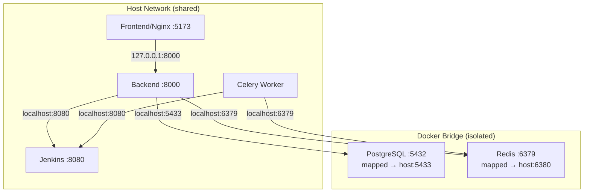

# Docker ↔ Jenkins Network Fix — Summary

## Problem
Containers (backend, celery, frontend) ran on Docker's isolated bridge network (`172.18.0.0/16`) and **could not reach Jenkins** at `192.168.1.101:8080` on the host machine. The host firewall blocked all traffic from bridge interfaces to host ports — causing `ConnectTimeoutError` on every Jenkins API call.

The earlier `iptables` fix (`-i docker0`) targeted the wrong interface — Docker Compose creates its own bridge (`br-74424e6fd8fc`), not `docker0`.

## Solution: `network_mode: host`

Application containers now share the host's network stack directly:

## Files Changed

| File | Change |
|------|--------|
| `docker/docker-compose.yml` | Added `network_mode: host` for backend, celery, frontend. Added redis port mapping `6380:6379`. Override env vars to use `localhost` |
| `docker/docker-compose.staging.yml` | Staging-specific localhost URLs. Removed dangerous `dist` volume mount |
| `docker/docker-compose.dev.yml` | **New file** — dev overlay with host network config |
| `docker/docker-compose.test.yml` | Updated for host network + env var fixes |
| `docker/nginx.conf` | `listen 5173` (direct), `proxy_pass http://127.0.0.1:8000` |

## Connectivity Test Results

| Route | Status |
|-------|--------|
| Backend → Jenkins (`localhost:8080`) | ✅ 403 (reachable, auth required) |
| Backend → Postgres (`localhost:5433`) | ✅ Connected |
| Backend → Redis (`localhost:6379`) | ✅ PONG |
| Browser → Frontend (`localhost:5173`) | ✅ 200 |
| Frontend → API proxy (`/api/`) | ✅ 200 |
| Backend direct (`localhost:8000`) | ✅ 200 |

## Key Design Decisions

1. **Why host network?** — The host firewall blocks all Docker bridge → host traffic. Fixing iptables is fragile (bridge names are dynamic, rules are lost on reboot). Host network is permanent.
2. **Why keep postgres/redis on bridge?** — Avoids port conflicts with local services (local Redis was already on 6379). Mapped to `5433` and `6380`.
3. **Why redis on port 6380?** — A local Redis is already running on `6379`. Backend uses the local Redis directly; the container Redis is a backup.
